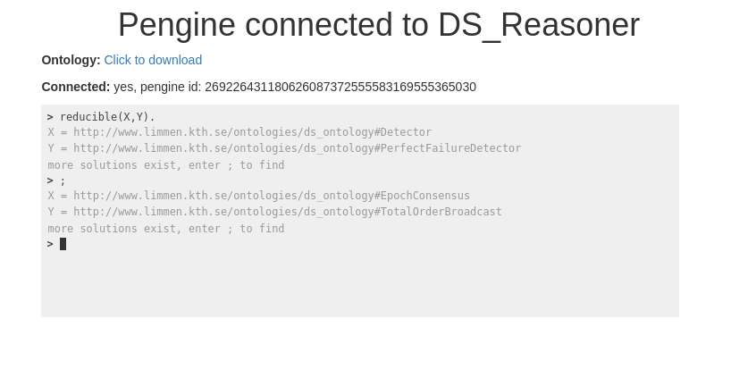

# ds_semweb

## Description

A simple ontology and reasoner for distributed systems theory.

## Usage

### Reasoner

    $ swipl

    ?- [ds_reasoner].
    % Parsed "ds_ontology.owl" in 0.01 sec; 612 triples
    true.
    ?- run_tests(ds_reasoner).
    % PL-Unit: ds_reasoner 
    done
    % All 6 tests passed
    true.    
    ?-  setof(X, reducible('http://www.limmen.kth.se/ontologies/ds_ontology#EventuallyWeakFailureDetector', X), Y).
    Y = ['http://www.limmen.kth.se/ontologies/ds_ontology#Detector',
         'http://www.limmen.kth.se/ontologies/ds_ontology#EventualLeaderElector',
         'http://www.limmen.kth.se/ontologies/ds_ontology#EventuallyDetector',
         'http://www.limmen.kth.se/ontologies/ds_ontology#EventuallyPerfectFailureDetector',
         'http://www.limmen.kth.se/ontologies/ds_ontology#EventuallyStrongFailureDetector',
         'http://www.limmen.kth.se/ontologies/ds_ontology#EventuallyWeakFailureDetector',
         'http://www.limmen.kth.se/ontologies/ds_ontology#LeaderElector',
         'http://www.limmen.kth.se/ontologies/ds_ontology#PerfectFailureDetector',
         'http://www.limmen.kth.se/ontologies/ds_ontology#StrongDetector',
         'http://www.limmen.kth.se/ontologies/ds_ontology#WeakFailureDetector'].

### Web client

**Start the server**:
 
    $ swipl
    
    ?- [server].
    % Parsed "ds_ontology.owl" in 0.01 sec; 612 triples
    true.
    
    ?- server(4000).
    % Started server at http://localhost:4000/
    true.
   
And point your browser to [http://localhost:4000/](http://localhost:4000/)

From the webclient you have access to the following safe-predicates by the pengine:

* The generic `rdf/3` predicate, and the following predicates from the reasoner:
* `reducible/2`
* `solvable/2`
* `stronger_model/2`
* `equivalent_model/2`
* `algorithm_can_solve/2`
* `algorithm_stronger_than/2`

If you modify the web-client you can re-generate the compressed static files hosted by the server as follows:

In webclient/ run: 
    
    $ npm run build
    
    > webclient@0.1.0 build /hdd/workspace/semweb/ds_semweb/webclient
    > react-scripts build
    
    Creating an optimized production build...
    Compiled successfully.
    
    File sizes after gzip:
    
      147.17 KB (-2 B)  build/static/js/main.04e17fd7.js
      712 B             build/static/css/main.439ab1e8.css
    
    The project was built assuming it is hosted at the server root.
    To override this, specify the homepage in your package.json.
    For example, add this to build it for GitHub Pages:
    
      "homepage": "http://myname.github.io/myapp",
    
    The build folder is ready to be deployed.
    You may serve it with a static server:
    
      npm install -g serve
      serve -s build
    
## License

Creative Commons Attribution-ShareAlike 4.0 International License.

## Author

Kim Hammar

<kimham@kth.se>
